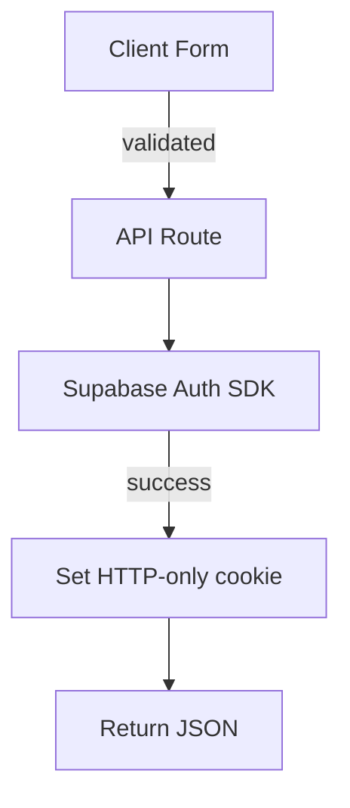
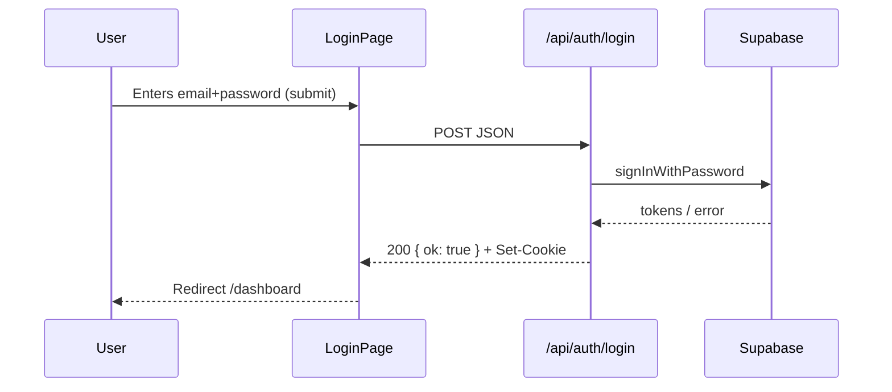

# Authentication Module Architecture Specification (Registration, Login, Password Recovery)

Author: AI Mentor
Date: 2025-11-05

---

## 1. Context and Assumptions

- Requirements sources: PRD (`.ai/prd.md`) – User Stories US-001 (registration) and US-002 (login).
- Tech stack: Next.js 19 (React 19, TypeScript 5), Tailwind 4, shadcn/ui, Supabase (Postgres + Auth), Vercel/DigitalOcean hosting.
- The application already has a directory structure described in the project documentation – this specification adheres to that structure and **does not disrupt** existing functionality.

---

## 2. User Interface Architecture

### 2.1 Layout Structure

| Layout       | Location                     | Visibility                | Responsibility                                                                                                             |
| ------------ | ---------------------------- | ------------------------- | -------------------------------------------------------------------------------------------------------------------------- |
| `AuthLayout` | `src/layouts/AuthLayout.tsx` | Public pages `/auth/*`    | • Minimalist header with logo • Slot for forms • Links switching between registration ↔ login • No application navigation |
| `AppLayout`  | `src/layouts/AppLayout.tsx`  | Private pages after login | • Navigation, sidebar • Slot for `<Outlet>` • Session control (redirect to `/auth/login` when token missing)               |

### 2.2 New Pages and Routing

| Path                    | File                                 | Main Component         | Scenario                    |
| ----------------------- | ------------------------------------ | ---------------------- | --------------------------- |
| `/auth/register`        | `src/pages/auth/register.tsx`        | `<RegisterPage>`       | Account creation form       |
| `/auth/login`           | `src/pages/auth/login.tsx`           | `<LoginPage>`          | Login form                  |
| `/auth/forgot-password` | `src/pages/auth/forgot-password.tsx` | `<ForgotPasswordPage>` | Send reset link             |
| `/auth/reset-password`  | `src/pages/auth/reset-password.tsx`  | `<ResetPasswordPage>`  | Set new password from token |

> **SSR/SSG**: Pages in `/auth/*` are rendered statically (`export const dynamic = "force-static";`) – no dependencies on private data.

### 2.3 Form Components (shadcn/ui + react-hook-form)

1. `AuthForm.tsx` (presentation layer)
   - Accepts form fields as `children` (render-props) and props `onSubmit`, `title`, `variant`.
   - Displays common layout + `Button`, `Input`, `Label`, `FormError`.
2. `RegisterForm.tsx`
   - Fields: `email`, `password`, `confirmPassword`.
   - Client-side validation (Zod); additionally checks password match.
3. `LoginForm.tsx`
   - Fields: `email`, `password`.
4. `ForgotPasswordForm.tsx`
   - Field: `email`.
5. `ResetPasswordForm.tsx`
   - Fields: `password`, `confirmPassword` + hidden `oobCode` (token from URL).

### 2.4 Validation and Messages

| Error                  | Message (EN)                                                                     | Layer             |
| ---------------------- | -------------------------------------------------------------------------------- | ----------------- |
| Invalid email          | "Please provide a valid email address."                                          | client and server |
| Password too short     | "Password must be at least 8 characters, contain a digit and special character." | client and server |
| Passwords don't match  | "Passwords do not match."                                                        | client            |
| Invalid credentials    | "Invalid email or password."                                                     | server            |
| Account already exists | "An account with this email already exists."                                     | server            |
| Rate limit exceeded    | "Too many failed attempts. Please try again later."                              | server            |

> The `<FormError message="..."/>` component renders messages in shadcn/ui `AlertDestructive` style.

### 2.5 User Scenarios (Happy Path)

1. **Registration** → Validation → API Request → Success ⇒ Success alert + redirect `/auth/login`.
2. **Login** → Validation → API Request → Success ⇒ Save session in `supabase.auth.setSession` ⇒ redirect.
3. **Forgot Password** → Validation → API Request → Success ⇒ Banner "Check your email inbox".
4. **Reset Password (from link)** → Validation → API → Success ⇒ Alert + redirect to `/auth/login`.

---

## 3. Backend Logic (Next.js API Routes)

### 3.1 Contract Layer (`src/types.ts`)

```ts
export interface AuthResponse {
  ok: boolean
  message?: string
}
```

### 3.2 Endpoints

| Method | Endpoint                    | File                                    | Input                   | Output                        |
| ------ | --------------------------- | --------------------------------------- | ----------------------- | ----------------------------- |
| POST   | `/api/auth/register`        | `src/pages/api/auth/register.ts`        | `{ email, password }`   | `AuthResponse`                |
| POST   | `/api/auth/login`           | `src/pages/api/auth/login.ts`           | `{ email, password }`   | `AuthResponse + Set-Cookie`   |
| POST   | `/api/auth/forgot-password` | `src/pages/api/auth/forgot-password.ts` | `{ email }`             | `AuthResponse`                |
| POST   | `/api/auth/reset-password`  | `src/pages/api/auth/reset-password.ts`  | `{ oobCode, password }` | `AuthResponse`                |
| POST   | `/api/auth/logout`          | `src/pages/api/auth/logout.ts`          | –                       | `AuthResponse + Clear-Cookie` |

### 3.3 Flow



- **HTTP-only secure cookie** stores `access_token` + `refresh_token`.
- Middleware (`src/middleware.ts`) validates token for requests to private paths.

### 3.4 Server-Side Validation

- Zod schemas in `src/lib/validation/auth.ts`.
- Supabase errors mapped to status 400/401.
- Rate limiting (middleware `src/pages/api/_rate-limit.ts`).

### 3.5 Exception Handling

```ts
try {
  /* supabase call */
} catch (err) {
  if (isSupabaseError(err, 'User already registered')) return 409
  /* default */ return 500
}
```

---

## 4. Authentication System – Supabase

1. **Registration** – `supabase.auth.signUp({ email, password, options: { emailRedirectTo: NEXT_PUBLIC_SITE_URL + '/auth/login' } })`.
2. **Login** – `supabase.auth.signInWithPassword({ email, password })`.
3. **Password Reset** – `supabase.auth.resetPasswordForEmail(email, { redirectTo: NEXT_PUBLIC_SITE_URL + '/auth/reset-password' })`.
4. **Set New Password** – `supabase.auth.updateUser({ password })` after `supabase.auth.setSession` with token from URL.
5. **Logout** – `supabase.auth.signOut()` + clear cookies.

- **RLS**: `auth.uid() = id` – private tables.
- **Email templates** hosted in Supabase → application name "Pantry Pilot".

---

## 5. Sequence Diagram – Login



---

## 6. Conclusions and Recommendations

- Implement **two-sided validation** (client + server) – minimizes unnecessary requests.
- Tokens in cookies **HTTP-Only, Secure, SameSite=Lax** – protection against XSS.
- Session middleware should refresh tokens (`supabase.auth.refreshSession`) on every SSR request.
- For future modules (Collaborations), roles can be extended in JWT.

---

_Specification completed._
